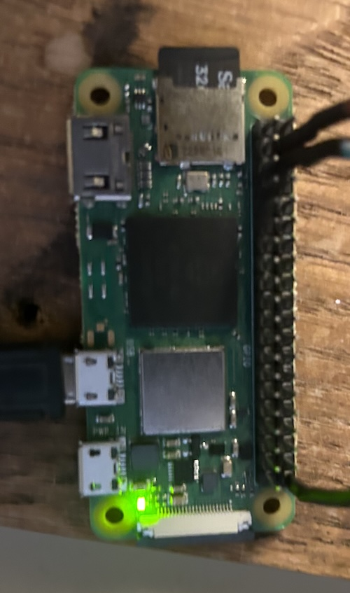
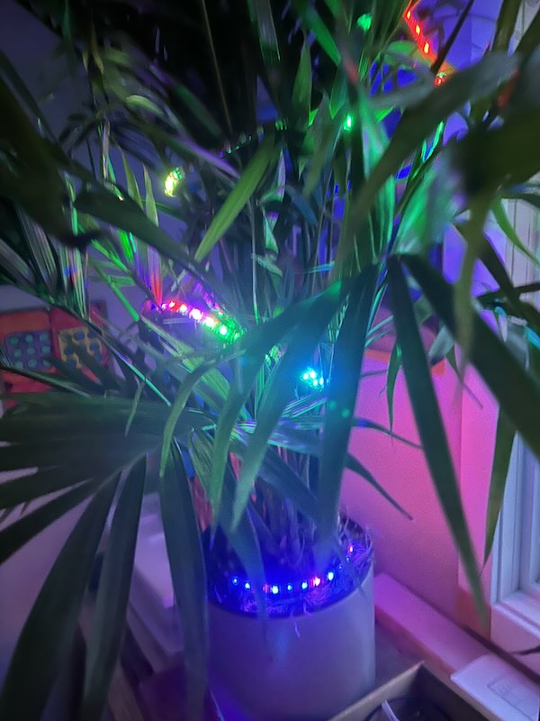

# DASBLINKEN

For making dasblinkenlights with a Pi in go.

Run you holiday lights!   Make your office-fern all festive or something.

This does all the fancy work of cross compiling for armv7 and linking in ws281x support bindings
so you can focus on dasblinken and not dasboilerplate.

With many thanks to https://pkg.go.dev/github.com/rpi-ws281x/rpi-ws281x-go

## Deploying

You probably want to modify the constants in the makefile.  The ts auth key is pulled
out of the local env.  Everything else is hardcoded to values that depend on what you want.

The piled sample app runs as a tsnet client on your tailnet too but you can
easily modify it to just run as a normal webserver.

The only support arch is 32 bit armV7.  A pi zero 2w running bare bones
Rasbian Bookwork (Debian) will get it done.  

The default.json config uses GPIO29 or Pin 21  (the last pin on the first row of the header)
by default.  Often, no level shifter is needed.  YMMV, but if you see instability, a 3.3 -> 5V 
level shifter might be required.

Connect your led strips power to the raw 5v header and ground to ground. 
 
Header (pi 2w pictured):
```
opgoooooooooooooooos
oooooooooooooooooooo

p - 5v power (raw from usb)
g - ground
s - signal
```



Multiple channels might work?  It hasn't been tested.  300 led strips seem OK with a decent
power supply.


Modify config.json to match your LED strip.  The effects package includes a number
of effects that will work on strips and matrices.  ~/.ssh

We assume no responsibility for dasMagicSmoke...

```bash
% export AUTHKEY=<an auth key for your tailnet>
% make builder-image
% make all
% make deploy
% make run
```

You can then http://dasblinken (or whatever you set TSNAME to)



